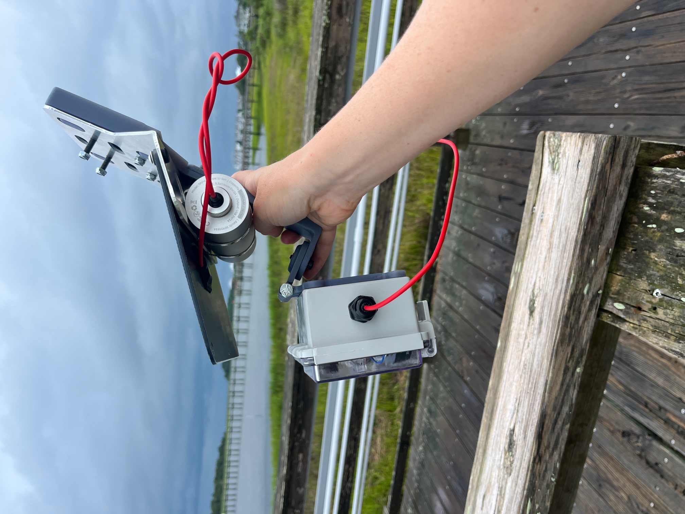

# The Boron & OpenMV TinyCamML: 
### A small field-deployable camera with a cell connection.

### Overview:
Have you ever wanted to deploy a field camera, use machine learning on the images, and then send some message via cell? Us too! This repository is our work-in-progress on building the camera of our dreams. 

Our initial goal is to build cameras that overlook roadways, take pictures of the road, determine if the roadway is flooded, and send a simple message (i.e., 'flooded' or 'not flooded') via cell to a google sheet. 

The repository has multiple parts:

- a `Firmware` folder, that contains the OpenMV code and the Particle Boron code. The OpenMV handles taking pictures and using a ML model. The Boron handles publishing the ML model results to a google sheet via cell. 
- a `hardware` folder, that contains the 3D primnted parts, the circuit diagram, and the bill of materials for building the camera and the housing. 
- a `dev` folder, that has some snippets of code that were useful in building, testing, adn debugging the device
- an assets folder, that contains a [pdf of a build guide](assets/2024_12_02_BuildGuide.pdf) for the TinyCamML. If you have comments, you can add them to our [google document of the build guide](https://docs.google.com/document/d/1C9PLoJusVJ-cXYZn4gjNS5eJlwIkASh2FyWyaLo89QA/edit?usp=sharing)

### Do you want to be involved?:

- Get in touch with us, we would be happy to collaborate!
- Read through the repository to look at the files/code we provide.
-Check out the open issues and participate in our discussion.

### Code of Conduct:
We intend to foster an inclusive and respectful environment surrounding the contribution and discussion of our project. Make sure you understand our Code of Conduct.
